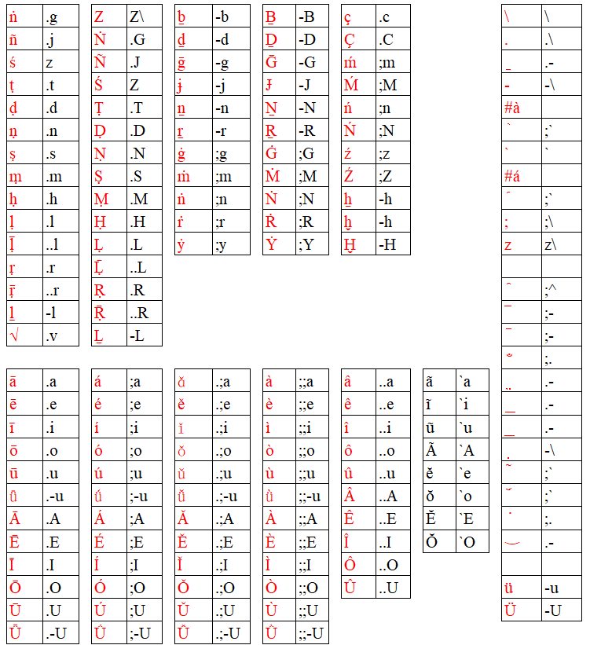

# **Rime小狼毫輸入法安裝與使用**

https://docs.qq.com/doc/DQW1nbmZZTEFNQVNx

# **rime梵藏輸入方案**

- **天城體** devanagari

https://github.com/arpcn/rime-devanagari/

- **IAST**

https://github.com/arpcn/rime-iast

- **悉曇體**及**婆羅米** Siddham & Brahmi

https://github.com/arpcn/rime-siddham

- **藏文**

https://github.com/arpcn/rime-tibetan

# **鍵盤分布**

這一套輸入方案中，IAST、天城、悉曇、婆羅米、藏文，都是[**一樣的編碼方式**](#)。

查看 ☞ <b><i>表格文本</i></b> ☜ 點擊 ◂ 

|ṅ|.g|Z|Z\ |ḇ|-b|Ḇ|-B|ç|.c|||\ |\ |
|-|-|-|-|-|-|-|-|-|-|-|-|-|-|
|ñ|.j|Ṅ|.G|ḏ|-d|Ḏ|-D|Ç|.C|||.|.\ |
|ś|z|Ñ|.J|ḡ|-g|Ḡ|-G|ḿ|;m|||̠|.-|
|ṭ|.t|Ś|Z|ɉ|-j|Ɉ|-J|Ḿ|;M|||-|-\ |
|ḍ|.d|Ṭ|.T|ṉ|-n|Ṉ|-N|ń|;n|||#à||
|ṇ|.n|Ḍ|.D|ṟ|-r|Ṟ|-R|Ń|;N|||̀|;`|
|ṣ|.s|Ṇ|.N|ġ|;g|Ġ|;G|ź|;z|||`|`|
|ṃ|.m|Ṣ|.S|ṁ|;m|Ṁ|;M|Ź|;Z|||#á||
|ḥ|.h|Ṃ|.M|ṅ|;n|Ṅ|;N|ẖ|-h|||́|;`|
|ḷ|.l|Ḥ|.H|ṙ|;r|Ṙ|;R|ḫ|-h|||;|;\ |
|ḹ|..l|Ḷ|.L|ẏ|;y|Ẏ|;Y|Ḫ|-H|||z|z\ |
|ṛ|.r|Ḹ|..L|||||||||||
|ṝ|..r|Ṛ|.R|||||||||̂|;^|
|ḻ|-l|Ṝ|..R|||||||||̅|;-|
|√|.v|Ḻ|-L|||||||||̄|;-|
|||||||||||||̐|;.|
|ā|.a|á|;a|ǎ|.;a|à|;;a|â|..a|ã|`a|̤|.-|
|ē|.e|é|;e|ě|.;e|è|;;e|ê|..e|ĩ|`i|̲|.-|
|ī|.i|í|;i|ǐ|.;i|ì|;;i|î|..i|ũ|`u|͟|.-|
|ō|.o|ó|;o|ǒ|.;o|ò|;;o|ô|..o|Ã|`A|̥|-\ |
|ū|.u|ú|;u|ǔ|.;u|ù|;;u|û|..u|ĕ|`e|̃|;`|
|ǖ|.-u|ǘ|;-u|ǚ|.;-u|ǜ|;;-u|Â|..A|ŏ|`o|̆|;`|
|Ā|.A|Á|;A|Ǎ|.;A|À|;;A|Ê|..E|Ĕ|`E|̇|;.|
|Ē|.E|É|;E|Ě|.;E|È|;;E|Î|..I|Ŏ|`O|⌣|.-|
|Ī|.I|Í|;I|Ǐ|.;I|Ì|;;I|Ô|..O|||||
|Ō|.O|Ó|;O|Ǒ|.;O|Ò|;;O|Û|..U|||ü|-u|
|Ū|.U|Ú|;U|Ǔ|.;U|Ù|;;U|||||Ü|-U|
|Ǖ|.-U|Ǘ|;-U|Ǚ|.;-U|Ǜ|;;-U|||||||

